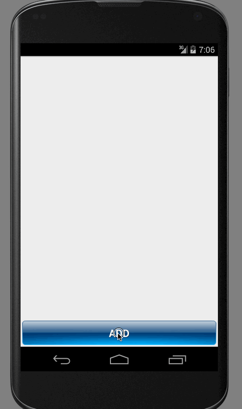

Codepath-Simple-ToDo
====================
This is a simple todo android application.

Completed user stories:

 * [x] Required:   Add and remove items from the todo list
 * [x] Required:   Edit item with a click on the todo list
 * [x] Required:   Delete item with a long click on the todo list
 * [x] Required:   The list is persisted properly when the app is restarted
 * [x] Optional:   Persist the todo items into SQLite instead of a text file
 * [x] Optional:   Improve style of the todo items in the list using a custom adapter
 * [x] Optional:   Add support for completion due dates for todo items (and display within listview item)
 * [x] Optional:   Use a DialogFragment instead of new Activity for editing items
 * [x] Additional: Add support for selecting the priority of each todo item (and display in listview item)
 * [x] Additional: Improve the UI/UX (Colors, imagen, style)
 * [x] Additional: Use a DialogFragment for adding todo items
 * [x] Additional: Confirm when an user erase an item using an Alert Dialog
 * [x] Additional: the list is sorted by date

# Walkthrough of all user stories:

GIF created with [LiceCap](http://www.cockos.com/licecap/).
