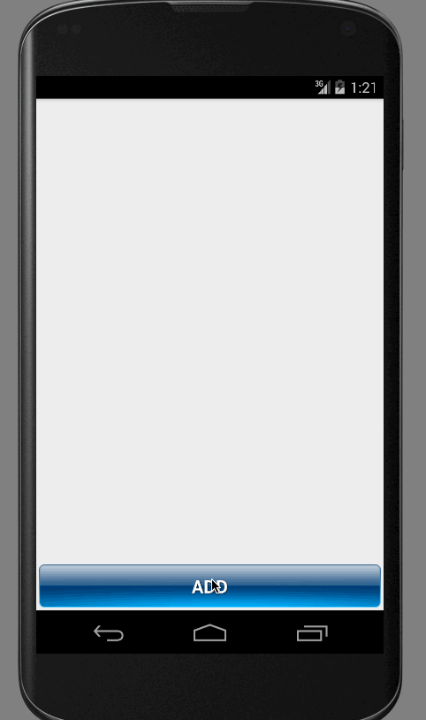

#ToDoList 

> What's ToDoList?

This is a *To do list app* that helps individuals achieve their goals.

> What can you do?

 * Add and remove items from the To do list.
 * Edit item with a click on the To do list.
 * Delete item with a long click on the To do list.
 * Add due dates and priority for todo items.

> What are the additional features?

 * The list is persisted properly when the app is restarted using SQLite.
 * Use a DialogFragment for adding To do items.
 * Improve style of the To do items in the list using a custom adapter.
 * the list is sorted by date
 * Confirm when an user erase an item using [SweetAlertDialog](https://github.com/pedant/sweet-alert-dialog)
 * Show an AlertDialog when an user create a new item using [SweetAlertDialog](https://github.com/pedant/sweet-alert-dialog)

## Walkthrough

## License
 * [Apache Version 2.0](http://www.apache.org/licenses/LICENSE-2.0.html)

## Acknowledgements
 * [ActiveAndroid](https://github.com/pardom/ActiveAndroid)
 * [SweetAlertDialog](https://github.com/pedant/sweet-alert-dialog): SweetAlert for Android, a beautiful and clever alert dialog

## Gif Information
 * GIF created with [LiceCap](http://www.cockos.com/licecap/).
